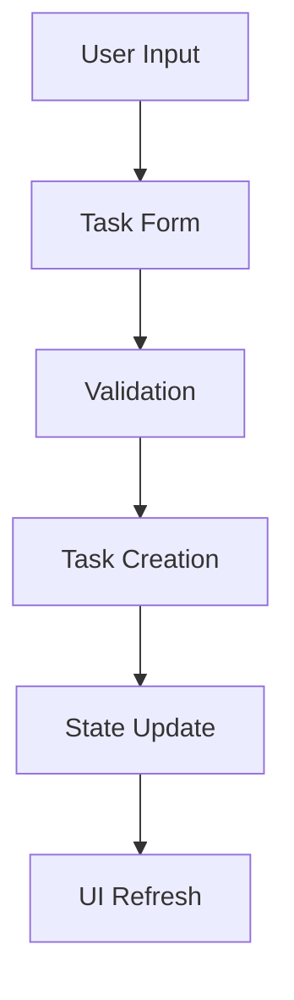
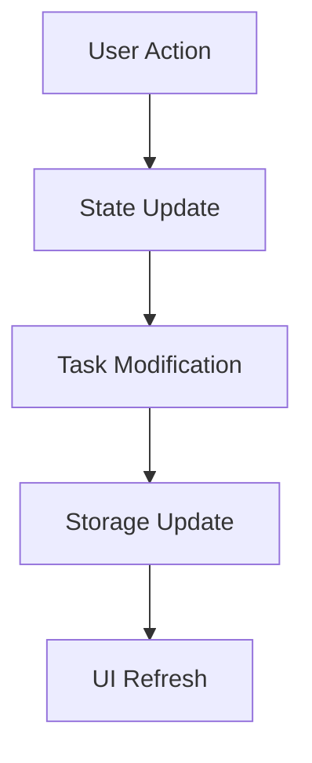

# Technical Architecture

## System Design

### 1. Core Architecture

The application follows a modular architecture with clear separation of concerns:

```
src/
├── main.rs           # Entry point
├── app.rs           # Application state
├── task.rs          # Task data model
├── configuration.rs # Settings management
├── ui/              # User interface
│   ├── mod.rs       # UI components
│   ├── all_tasks_page.rs
│   ├── task_page.rs
│   └── delete_task_page.rs
├── cli/             # Command line interface
├── utils.rs         # Utilities
├── repeat.rs        # Recurring tasks
└── day_of_week.rs   # Date handling
```

### 2. State Management

The application uses a centralized state management approach:

1. **App State** (`app.rs`):
   - Manages the global application state
   - Handles task CRUD operations
   - Maintains UI state
   - Manages configuration

2. **Task State** (`task.rs`):
   - Individual task data
   - Task validation
   - Task serialization

3. **Configuration State** (`configuration.rs`):
   - User preferences
   - UI settings
   - Keybindings

### 3. Data Flow

#### Task Creation Flow


#### Task Management Flow


### 4. Key Components

#### Task Management (`task.rs`)
```rust
pub struct Task {
    pub id: u32,
    pub name: String,
    pub date: Option<DateTime<Local>>,
    pub repeats: Option<Repeat>,
    pub group: Option<String>,
    pub description: Option<String>,
    pub url: Option<String>,
    pub complete: bool,
}
```

Key methods:
- `new()`: Create new task
- `validate()`: Validate task data
- `serialize()`: Convert to storage format
- `deserialize()`: Load from storage

#### UI Components (`ui/mod.rs`)

1. **Layout Management**:
```rust
pub struct Layout {
    pub tasks: Rect,
    pub details: Rect,
    pub status: Rect,
}
```

2. **Event Handling**:
```rust
pub enum Event {
    Key(KeyEvent),
    Mouse(MouseEvent),
    Resize(u16, u16),
}
```

3. **View States**:
```rust
pub enum ViewState {
    TaskList,
    TaskEdit,
    TaskDelete,
    Configuration,
}
```

#### Configuration System (`configuration.rs`)

1. **Settings Structure**:
```rust
pub struct Settings {
    pub date_formats: DateFormats,
    pub show_complete: bool,
    pub current_group: Option<String>,
    pub icons: Icons,
    pub colors: Colors,
    pub keybindings: Keybindings,
}
```

2. **Configuration Management**:
- File-based storage
- JSON serialization
- Default values
- Validation

### 5. Error Handling

The application implements a comprehensive error handling system:

```rust
pub enum AppError {
    IoError(std::io::Error),
    ConfigError(String),
    TaskError(String),
    ValidationError(String),
}
```

### 6. Testing Strategy

1. **Unit Tests**:
   - Task validation
   - Configuration management
   - Utility functions

2. **Integration Tests**:
   - Task CRUD operations
   - Configuration loading/saving
   - UI state management

3. **End-to-End Tests**:
   - User workflows
   - CLI commands
   - UI interactions

### 7. Performance Considerations

1. **Task Storage**:
   - Efficient serialization
   - Lazy loading
   - Caching

2. **UI Rendering**:
   - Minimal redraws
   - Efficient layout calculations
   - Event batching

3. **Memory Management**:
   - Smart pointers
   - Resource cleanup
   - Memory pooling

### 8. Security Considerations

1. **Data Storage**:
   - Secure file permissions
   - Data validation
   - Input sanitization

2. **Configuration**:
   - Safe defaults
   - Validation
   - Error handling

### 9. Extension Points

1. **Task Properties**:
```rust
pub trait TaskExtension {
    fn additional_properties(&self) -> HashMap<String, Value>;
    fn validate_extension(&self) -> Result<(), AppError>;
}
```

2. **UI Components**:
```rust
pub trait UIComponent {
    fn render(&self, f: &mut Frame);
    fn handle_event(&mut self, event: Event) -> Result<(), AppError>;
}
```

3. **Storage Backends**:
```rust
pub trait StorageBackend {
    fn save_tasks(&self, tasks: &[Task]) -> Result<(), AppError>;
    fn load_tasks(&self) -> Result<Vec<Task>, AppError>;
}
```

### 10. Dependencies

```toml
[dependencies]
tui = "0.19"           # Terminal UI framework
chrono = "0.4"         # Date/time handling
serde = { version = "1.0", features = ["derive"] }  # Serialization
serde_json = "1.0"     # JSON handling
crossterm = "0.26"     # Terminal manipulation
```

### 11. Build and Deployment

1. **Build Process**:
   - Cargo-based build system
   - Release optimization
   - Binary distribution

2. **Installation**:
   - Cargo install
   - Binary distribution
   - Configuration setup

3. **Updates**:
   - Version management
   - Configuration migration
   - Data format updates 